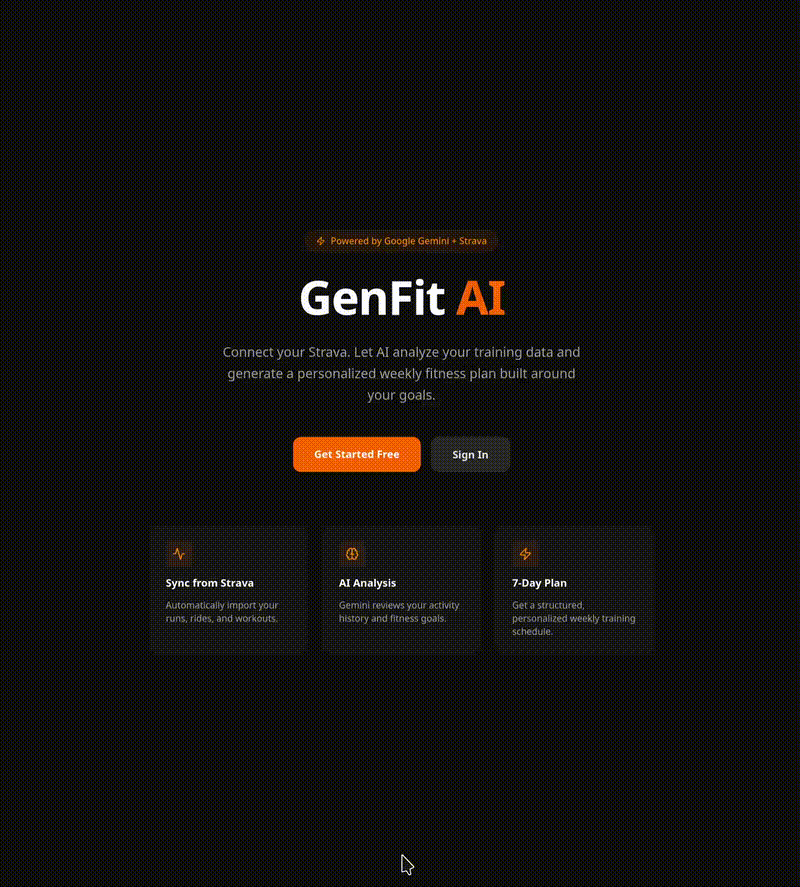

# GenFit AI



AI-powered personalized fitness dashboard. Connect your Strava account, sync your activity data, and let Google Gemini generate a tailored 7-day training plan based on your history and goals.

## Tech Stack

- **Frontend**: Next.js 15 (App Router), TypeScript, Tailwind CSS
- **Backend**: Django 4.2, Django REST Framework, SimpleJWT
- **Database**: PostgreSQL
- **Integrations**: Strava OAuth API, Google Gemini (`gemini-2.5-flash`)

## Project Structure

```
genfit-ai/
├── backend/          # Django REST API
│   ├── accounts/     # User auth (JWT)
│   ├── strava/       # OAuth + activity sync
│   ├── plans/        # Gemini fitness plan generation
│   └── genfit/       # Django settings & URLs
├── frontend/         # Next.js app
│   └── src/
│       ├── app/      # Pages (auth, dashboard)
│       ├── components/
│       └── lib/      # API client, auth helpers
└── docker-compose.yml
```

## Getting Started

### Prerequisites

- Python 3.12+, Node.js 20+, PostgreSQL 16+ (or Docker)

### 1. Backend

```bash
cd backend
python -m venv venv && source venv/bin/activate
pip install -r requirements.txt

cp .env.example .env
# Edit .env with your keys

python manage.py migrate
python manage.py runserver
```

### 2. Frontend

```bash
cd frontend
npm install

cp .env.local.example .env.local
# Edit .env.local

npm run dev
```

### 3. Docker (all-in-one)

```bash
cp backend/.env.example backend/.env
cp frontend/.env.local.example frontend/.env.local
# Fill in real values in both .env files

docker compose up --build
```

Visit [http://localhost:3000](http://localhost:3000)

## Environment Variables

### Backend (`backend/.env`)

| Variable | Description |
|---|---|
| `SECRET_KEY` | Django secret key |
| `DATABASE_URL` | PostgreSQL connection string |
| `STRAVA_CLIENT_ID` | From [Strava API settings](https://www.strava.com/settings/api) |
| `STRAVA_CLIENT_SECRET` | From Strava API settings |
| `STRAVA_REDIRECT_URI` | Must match Strava app config (e.g. `http://localhost:8000/api/strava/callback/`) |
| `GEMINI_API_KEY` | From [Google AI Studio](https://aistudio.google.com/app/apikey) |
| `FRONTEND_URL` | Frontend origin for CORS + redirect (e.g. `http://localhost:3000`) |

### Frontend (`frontend/.env.local`)

| Variable | Description |
|---|---|
| `NEXT_PUBLIC_API_URL` | Backend URL (e.g. `http://localhost:8000`) |

## API Endpoints

| Method | Path | Description |
|---|---|---|
| `POST` | `/api/auth/register/` | Register + get JWT |
| `POST` | `/api/auth/login/` | Login + get JWT |
| `POST` | `/api/auth/token/refresh/` | Refresh access token |
| `GET` | `/api/auth/me/` | Current user profile |
| `GET` | `/api/strava/connect/` | Get Strava OAuth URL |
| `GET` | `/api/strava/callback/` | OAuth callback (Strava redirects here) |
| `POST` | `/api/strava/sync/` | Re-sync activities from Strava |
| `GET` | `/api/strava/activities/` | List synced activities |
| `POST` | `/api/plans/generate/` | Generate AI fitness plan |
| `GET` | `/api/plans/` | List previous plans |
